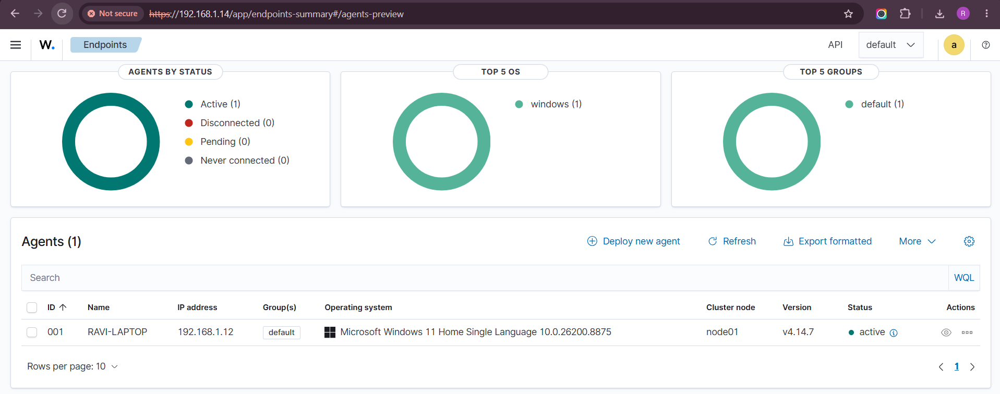
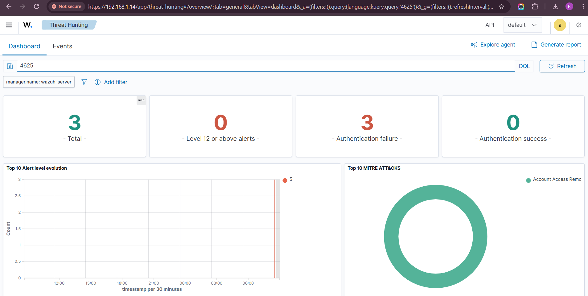
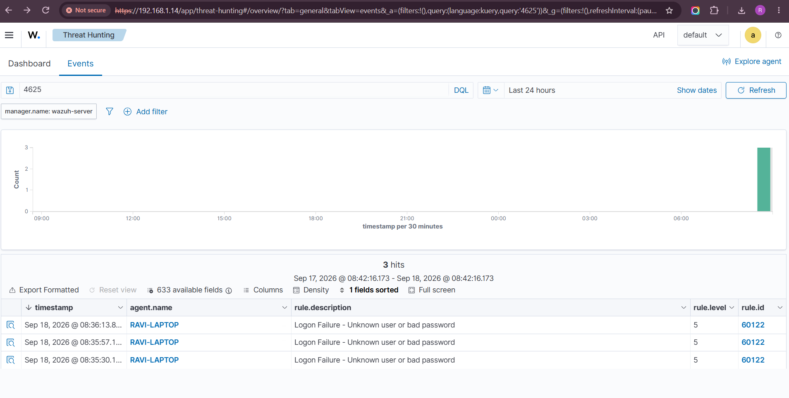
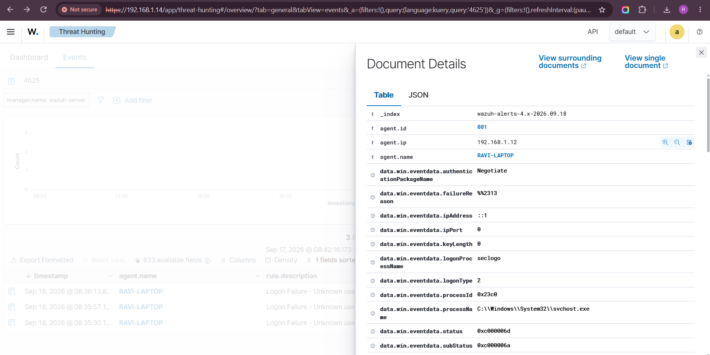
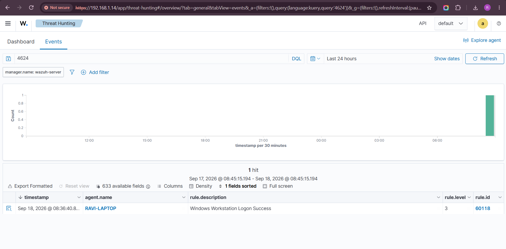

# Project 4: The Failed Login Alert — First SIEM Investigation with Wazuh

**Skills demonstrated:** SIEM, Wazuh, Windows Security Logs, authentication analysis,
alert triage, log correlation, false-positive analysis, incident documentation
**Environment:** Wazuh 4.14.7 (VMware Workstation appliance), Windows 11 host as
monitored endpoint, Wazuh agent v4.14.7

## Objective

Move from inspecting evidence directly (Wireshark, Event Viewer, Thunderbird) to
using a SIEM — a central platform that collects, searches, and correlates security
data from monitored endpoints. Investigate a sequence of failed authentication
attempts (Event ID 4625) followed by a successful login, and determine whether it
warrants escalation.

## Lab Setup

1. Imported the official Wazuh OVA (4.14.7 — manager, indexer, and dashboard
   pre-configured) into VMware Workstation, with the network adapter set to
   **Bridged** so the appliance received an IP on the same local network as the
   host laptop.
2. Powered on the Wazuh VM and retrieved its IP (`192.168.1.14`) via `ip a`.
3. Accessed the Wazuh dashboard from the host machine's browser at
   `https://192.168.1.14` and logged in.
4. Deployed the Wazuh agent directly on the physical Windows 11 laptop (used as
   the monitored endpoint) via the dashboard's **Deploy new agent** wizard, using
   `192.168.1.14` as the manager address.
5. Confirmed the agent (`RAVI-LAPTOP`) came online as **Active**.



## Generating the Activity

To produce a controlled, known sequence of failed and successful logons without
using the primary account, a disposable local test account (`soctest`) was
created and used with `runas` to generate three failed authentication attempts
(wrong password) followed by one successful attempt (correct password):

```
net user soctest Test@12345 /add
runas /user:soctest cmd   → wrong password (x3)
runas /user:soctest cmd   → correct password
```

## Investigation

### Searching for Event ID 4625 (Failed Logon)

Filter used in Wazuh's Threat Hunting module: `4625`



The dashboard summary immediately showed **3 total events, 3 authentication
failures, 0 successes**, tagged under MITRE ATT&CK technique **Account Access
Removal (T1531)** — matching the three deliberate failed attempts.



| Timestamp | Rule ID | Description | Level |
|---|---|---|---|
| 08:35:30 | 60122 | Logon Failure - Unknown user or bad password | 5 |
| 08:35:57 | 60122 | Logon Failure - Unknown user or bad password | 5 |
| 08:36:13 | 60122 | Logon Failure - Unknown user or bad password | 5 |

### Underlying Windows Event Detail



Key fields from the raw Windows event:

| Field | Value |
|---|---|
| Event ID | 4625 |
| Target account | `soctest` |
| Logon Type | `2` (interactive) |
| Failure reason | Unknown user name or bad password |
| Status / SubStatus | `0xc000006d` / `0xc000006a` (bad password) |
| Source | `::1` (localhost — same machine) |
| Process | `svchost.exe` |
| Agent | RAVI-LAPTOP (192.168.1.12) |

### Successful Login (Event ID 4624)



A single **Windows Workstation Logon Success** event (Rule ID 60118, Level 3)
was found at `08:36:40` — 27 seconds after the last failure.

### Timeline

```
08:35:30  Failed logon  (soctest, bad password)
08:35:57  Failed logon  (soctest, bad password)
08:36:13  Failed logon  (soctest, bad password)
08:36:40  Successful logon
```

Three failures followed by a success, all within 70 seconds, all from the same
local machine (source address `::1`).

## Case Note

**Disposition:** Expected test activity / false positive.

**Evidence:** Three failed authentication attempts against a local test account
(`soctest`) were recorded via Sysmon/Windows Security auditing and correlated in
Wazuh (Rule 60122, Event ID 4625), each attributable to a mistyped password
supplied through `runas`. A successful authentication for the same account
followed 27 seconds after the final failure, originating from the same local
workstation (Event ID 4624, Rule 60118).

**Action:** No escalation required for this controlled test — the pattern is
consistent with a user mistyping their own password on their own machine, not
an external brute-force or credential-stuffing attempt. In a production
environment, the same alert would still warrant a quick check of source,
account, and endpoint context before closing it: the disposition changes
significantly if the failures instead came from an unfamiliar source address,
targeted multiple accounts, or numbered in the hundreds rather than three.

## Key Takeaway

A SIEM's value isn't just collecting events — it's making correlation fast.
What would have taken manually scrolling through Event Viewer logs took a
single filtered search (`4625`) across the whole environment, immediately
surfacing count, timing, and MITRE ATT&CK context. But the SIEM still doesn't
make the judgment call: three failures followed by a quick success from the
same local machine is routine, while the same alert wording under different
source/volume/account conditions could mean something very different. That
context-dependent read is the analyst's job, not the tool's.
